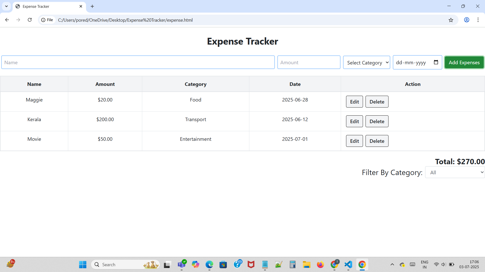

# Expense Tracker App

## Overview of the app
The Expense Tracker app helps users keep track of their daily expenses easily. Users can add, edit, and delete expenses, view a summary of their spending, and stay within their budget.

## Features implemented
- Add new expenses with details like amount, category, and date
- Edit or delete existing expenses
- View total expenses and expense list
- Filter expenses by date or category
- Responsive design for mobile and desktop
### Initial Screen (No Data)

### After Adding Transactions

 
 
